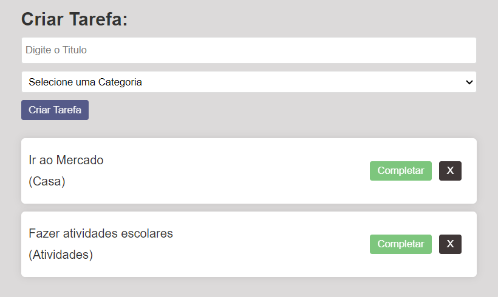

# Organizador de tarefas ✔️
Bem-vindo à nossa lista de tarefas, projetada para tornar sua vida mais organizada e eficiente. Com esta ferramenta, você pode facilmente editar, excluir e adicionar tarefas de maneira conveniente e intuitiva. Seja no trabalho, em casa ou em qualquer projeto, esta lista de tarefas proporcionará a você o controle necessário para manter tudo sob controle e alcançar seus objetivos de forma tranquila e eficaz. 
 ## Como clonar o projeto 👇

 Verifique se o Node.js esta instalado corretamente no sistema.

1. Abra o terminal e clone o projeto com o comando:

  git clone `https://github.com/isaabellepontes/ListadeTarefasM5.git`

 2. Ente no diretório:

  cd ListaDeTarefasM5

 3. Instalação das Dependências com o comando:  

  npm install

 4. inicie o projeto com:

   npm run dev 

## Tecnologias Utilizadas. 📌

REACT

## Como Utilizar 👉

### Entrada 

Na parte "Criar tarefa" Adicione um titulo e a categoria.

### Exemplo:

Ir ao mercado - Casa 

[Enter]

Fazer trabalhos escolares - Atividades

[Enter]

### Saída

## Referências ✅

[Documentação React](https://react.dev/)

## Agradecimentos 💕

Projeto desenvolvido com fins acadêmicos, como o projeto individual do modulo 5 da Resilia Educação. Sinta-se a vontade para utiliza-lo.

